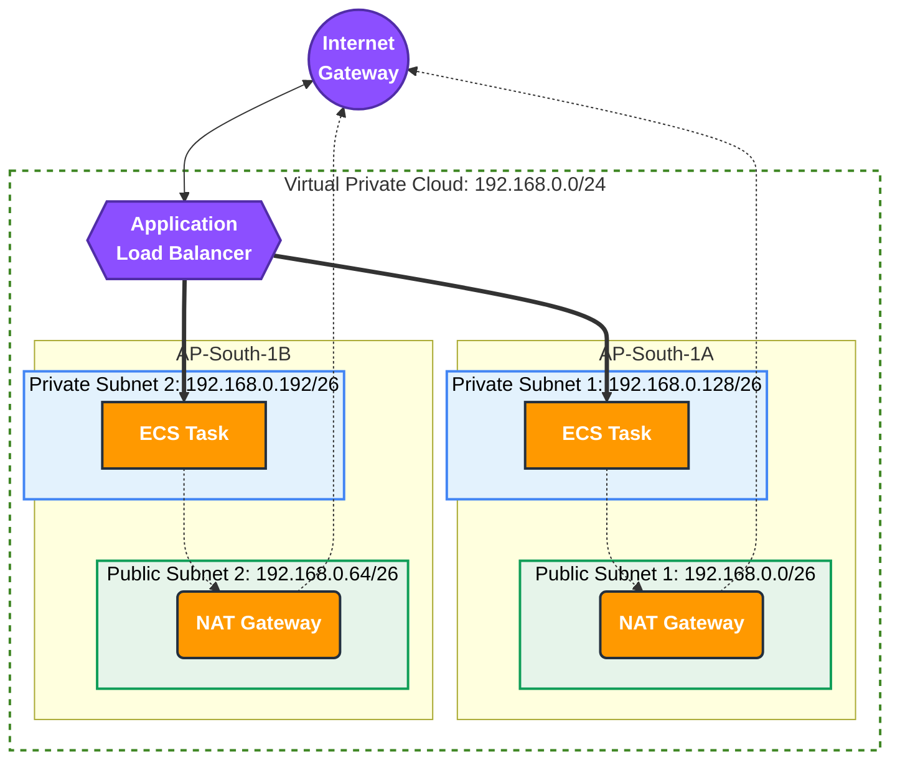

```mermaid
graph TB
    IGW((Internet<br>Gateway))

    subgraph VPC [Virtual Private Cloud: 192.168.0.0/24]
        direction TB
        ALB{{Application<br>Load Balancer}}

        subgraph AZ1 [AP-South-1A]
            direction TB
            subgraph PubSub1 [Public Subnet 1: 192.168.0.0/26]
                NAT1(NAT Gateway)
            end
            subgraph PrivSub1 [Private Subnet 1: 192.168.0.128/26]
                ECS1[ECS Task]
            end
        end

        subgraph AZ2 [AP-South-1B]
            direction TB
            subgraph PubSub2 [Public Subnet 2: 192.168.0.64/26]
                NAT2(NAT Gateway)
            end
            subgraph PrivSub2 [Private Subnet 2: 192.168.0.192/26]
                ECS2[ECS Task]
            end
        end
    end

    %% Routing and traffic flow
    IGW <--> ALB
    ALB ==> ECS1
    ALB ==> ECS2
    ECS1 -.-> NAT1
    ECS2 -.-> NAT2
    NAT1 -.-> IGW
    NAT2 -.-> IGW

    %% Styling
    classDef aws fill:#FF9900,stroke:#232F3E,stroke-width:2px,color:white,font-weight:bold;
    classDef vpc fill:#FFFFFF,stroke:#3F8624,stroke-width:2px,stroke-dasharray: 5 5;
    classDef pubSub fill:#E6F4EA,stroke:#0F9D58,stroke-width:2px,color:black;
    classDef privSub fill:#E3F2FD,stroke:#4285F4,stroke-width:2px,color:black;
    classDef gateway fill:#8C4FFF,stroke:#512DA8,stroke-width:2px,color:white,font-weight:bold;
    
    class VPC vpc;
    class PubSub1,PubSub2 pubSub;
    class PrivSub1,PrivSub2 privSub;
    class ECS1,ECS2,NAT1,NAT2 aws;
    class IGW,ALB gateway;
```
